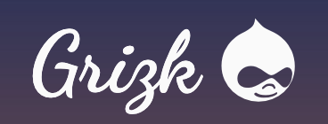
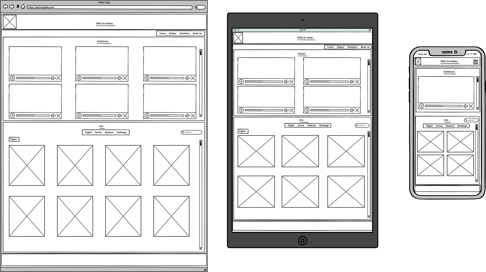
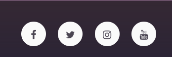
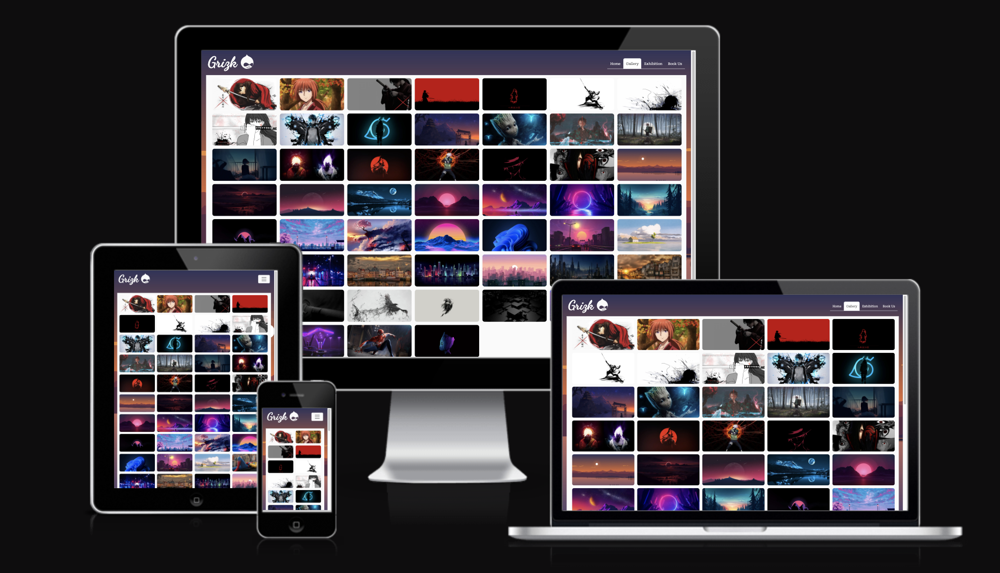
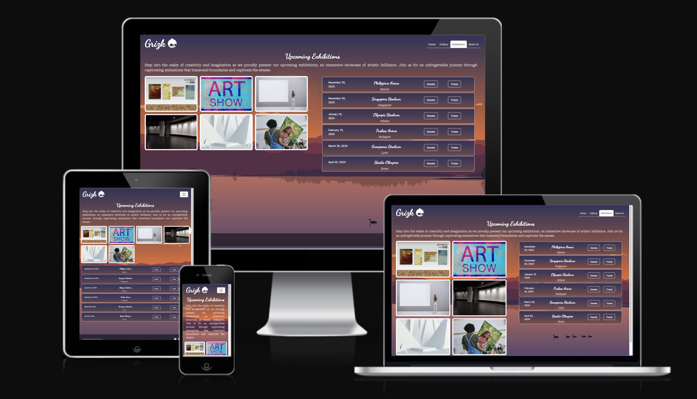
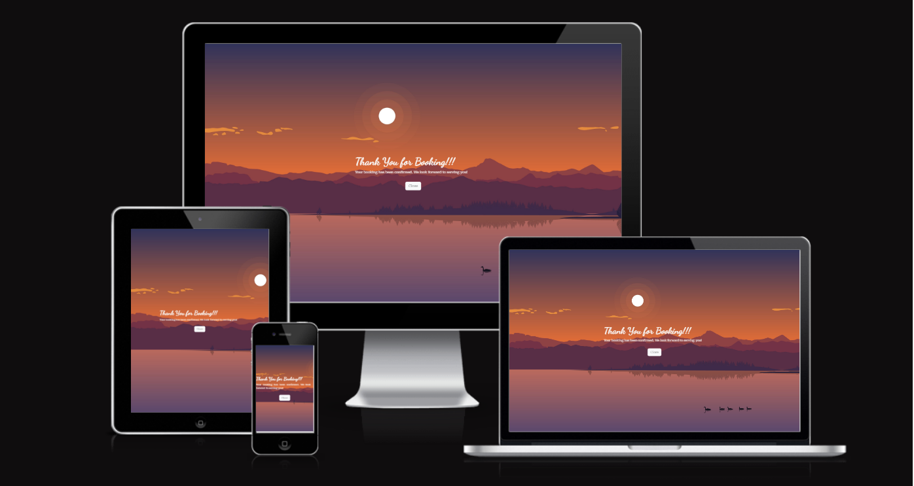

# Grizk Art Gallery

Visit the deployed site: [Grizk Art Gallery](https://gokwori.github.io/Grizk-Gallery/)

Embark on a journey into artistic expression at Grizk, a vibrant hub of contemporary and digital artworks. Dive into a dynamic space transcending imagination, fostering a community of artists and enthusiasts. Through curated exhibitions and cultural events, we inspire dialogue and connection. Join us at Grizk, where art transforms into a shared experience, leaving an indelible mark on your memories' canvas.

## CONTENTS

* [User Experience](#user-experience-ux)
  * [Project Goals](#project-goals)
  * [Art Lovers' Goals](#art-lovers-goals)
  * [Artists' Goals](#artists-goals)
  * [Business Goals](#business-goals)
  * [User Stories](#user-stories)
  

* [Design](#design)
  * [Colour Scheme](#colour-scheme)
  * [Typography](#typography)
  * [Imagery](#imagery)
  * [Wireframes](#wireframes)
  * [Features](#features)
    * [The Home Page](#the-home-page)
    * [The Gallery Page](#the-gallery-page)
    * [The Exhibition Page](#the-exhibition-page)
    * [The Booking Page](#the-booking-page)
    * [The Thank you Page](#the-thank-you-page)
    * [The Coming soon Page](#the-coming-soon-page)
    * [Future Implementations](#future-implementations)
  * [Accessibility](#accessibility)

* [Technologies Used](#technologies-used)
  * [Languages Used](#languages-used)
  * [Frameworks, Libraries & Programs Used](#frameworks-libraries--programs-used)

* [Deployment & Local Development](#deployment--local-development)
  * [Deployment](#deployment)
  * [Local Development](#local-development)
    * [How to Fork](#how-to-fork)
    * [How to Clone](#how-to-clone)

* [Testing](#testing)
  * [Solved Bugs](#solved-bugs)
  * [Known Bugs](#known-bugs)
  
* [Credits](#credits)
  * [Code Used](#code-used)
  * [Content](#content)
  * [Media](#media)
  * [Acknowledgments](#acknowledgments)

- - -

## User Experience (UX)

### Project Goals

The Grizk Official Website aims to create an engaging and informative platform for art enthusiasts and artists. Key objectives include presenting the gallery's mission, featuring recent releases and upcoming exhibitions, and simplifying the booking process for artists. The website serves as a strategic tool to boost art and ticket sales while attracting more exhibition bookings, aligning with broader business goals.

### Art Lovers Goals

* Learn about the gallery's objectives and vision for the art community.
* Explore and preview the most recent releases and additions to the gallery's collection.
* Receive updates on upcoming exhibitions, cultural events, and workshops.
* Browse the extensive art catalog showcasing diverse and contemporary artworks.
* Easily find and purchase artworks to enhance your personal collection.

### Artists Goals

* Simplify and expedite the exhibition booking process for artists.
* Provide clear and concise details about the gallery's availability for exhibitions.
* Foster collaboration between the gallery and artists to ensure seamless and successful exhibitions.

### Business Goals

* Create an aesthetically pleasing and user-friendly website to enhance the overall user experience.
* Increase the gallery's online presence and engagement with the audience.
* Drive art sales through effective showcasing and presentation of artworks on the website.
* Streamline the exhibition booking process for artists to encourage more participation.

### User Stories

#### Art Lovers:
* I want to easily access information about the gallery's objectives and mission.
* I want a user-friendly platform to discover and preview the latest artwork releases.
* I want to stay informed about upcoming exhibitions and events hosted by the gallery.
* I want the ability to explore the full art catalog and conveniently purchase paintings.

#### Artists:
* I want a simplified and expedited process for booking exhibitions at the gallery.
* I want clear information about the gallery's availability for exhibitions and submission guidelines.
* I want collaboration tools to ensure a seamless and successful exhibition experience.

#### General Users:
* I want a visually appealing and intuitive interface that is easy to navigate.
* I want the website to load quickly and efficiently to access information without delays.
* I want the website to be responsive and provide a seamless experience on various devices.

- - -

## Design Choices

### Colour Scheme

In the design of the art gallery website, I've intentionally selected a colour scheme dominated by `#fafafa` and `#4b4453` to complement the background image. The soft `#fafafa` serves as a subtle and clean backdrop, preventing the background image from overwhelming users. Meanwhile, the deep `#4b4453` adds sophistication and contrast, contributing to an aesthetically pleasing and balanced visual experience. This careful integration of colors ensures that the background image enhances the overall design without overpowering or distracting users, creating a harmonious and engaging atmosphere on the website.

In my css file I have used variables to declare colours, and then used these throughout the css file. I was recently introduced to this method during a hackathon - it is a useful convention to use as it allows you to alter the colour throughout the website if you decide to update a colour, by changing the colour once in the variable.

  

### Typography

Google Fonts was used to import the chosen fonts for use in the site.

* For the Page Title and Headings I have used the google font [Dancing Script](https://fonts.google.com/?preview.text=Grizk%20Art%20Gallery&preview.text_type=custom&query=dancing+script). Dancing Script is a lively and script-style font selected to evoke a sense of movement and artistic flair. Its graceful and flowing appearance adds a touch of elegance, reminiscent of handwritten scripts, creating a captivating visual experience for the page titles and headings.

* For the body of the page I have used the google font [Roboto Serif](https://fonts.google.com/?preview.text=Grizk%20Art%20Gallery&preview.text_type=custom&query=roboto+serif). Roboto Serif, with its varied font weights ranging from 200 to 800, provides a modern and sophisticated look. This font choice brings a balanced and clean aesthetic to your website's text, ensuring readability while maintaining a touch of refinement.

### Imagery

As Grizk Art Gallery celebrates diverse artistic expressions, the website showcases a dynamic blend of digital pictures, anime, 3D arts, and cityscapes sourced from [Wallpaper flare](https://www.wallpaperflare.com/). Each image carefully curated to immerse visitors in the rich tapestry of creativity, inviting them to explore the vibrant world of art within the virtual gallery.

### Wireframes

Wireframes were created for mobile, tablet and desktop using balsamiq.

### Features

The website is comprised of a home page, a gallery page, an exhibition page, a booking page, a thank-you page & a coming-soon page.

All Pages on the website are responsive and have:

* A favicon in the browser tab.

  

* The title of the site at the top of every page. This title serves as a clickable link that seamlessly navigates users back to the home page. The title design is elegantly presented to provide a consistent and intuitive user experience across the site.
  

* The website incorporates a streamlined and visually appealing navigation menu, facilitating easy access to key sections. Users can seamlessly explore different pages, including Home, Gallery, Exhibition, and Booking, enhancing overall navigation efficiency. The navigation menu is collapsible for a seamless experience on smaller screens.

  

* In the footer section, social media links are prominently displayed, providing users with direct access to the gallery's presence on popular platforms. The inclusion of links to Facebook, Twitter, Instagram, and YouTube fosters connectivity and engagement, allowing art enthusiasts to stay updated on the latest news and events.

  

#### The Home Page

The home page is thoughtfully designed to provide an engaging and immersive experience. The home page displays the site's name as a title and then different containers holding an autoplaying carousel containing 3 slides of different artworks, about us, latest release, upcoming exhibitions and visit our location sections.

The Autoplaying Carousel on the Grizk Art Gallery home page is a dynamic feature that automatically transitions between five distinct slides, each showcasing different artworks. Here's how it works:

Dynamic Visuals: The carousel is designed to be visually engaging, featuring high-quality images of various contemporary and digital artworks. These images change seamlessly to capture your attention and provide a diverse artistic experience.

Autoplay Functionality: The carousel operates on an autoplay mechanism, meaning it automatically transitions from one slide to the next after a set duration. 

The home page also has other sections like the about-us section, latest release, upcoming exhibitions and vist our locations sections that makes the it very interactive for users.

#### The Gallery Page

The gallery page is designed to enable visitors explore the rich tapestry of artistic expressions.

The gallery page has the following features:

* Diverse Art Categories: Navigate through a variety of art categories, including abstract, anime, buildings, and digital art.

* Interactive Image Grid: Engage with an interactive image grid showcasing the latest releases. Click on thumbnails to view larger images and appreciate the details.

#### The Exhibition Page

The exhibition page introduces visitors to upcoming exhibitions with a captivating header and a brief, inviting description. The section includes an image grid displaying glimpses of the showcased artworks, each linked to a larger view. The page also provides details about upcoming exhibitions, including dates, venues, and locations. Each exhibition entry includes buttons for accessing more details and purchasing tickets.

#### The Booking Page

The Booking Page serves as a platform for artists to submit their artworks for upcoming exhibitions organised by Grizk Art Gallery. The page has a clean and inviting design, providing artists with an opportunity to elevate their art to new heights.

* Artists can submit their details, including full name, email address, and an optional contact number. 
* A selection menu allows artists to choose the preferred exhibition venue from a list of options.
* The submission date can be selected using a date picker.
* Artists can provide a brief description of their artwork in a text area.
* The form is designed to be submitted to a Google Sheets document, facilitating easy management and tracking of artist submissions.
* Upon form submission, users are redirected to a 'Thank You' page.
* A JavaScript event listener is implemented to redirect users to a 'Thank You' page upon form submission.

#### The Thank-you Page

The Thank-you page successfully combines functionality with aesthetics, providing users with a positive confirmation experience after booking an exhibition. The thoughtful design and clear messaging contribute to an overall delightful user journey on the Grizk Art Gallery website.

#### The Coming-soon Page

The "Coming Soon" page for Grizk Art Gallery serves as a placeholder for future implementations, providing users with a brief message about the ongoing construction of the page. The design is minimalistic, offering a clean and straightforward user experience.

#### Future Implementations

##### User Engagement and Interaction

* Implement a user account system to enhance user engagement.
* Allow users to create profiles, track favorite artworks, and participate in the art community.
* Enable users to leave reviews and ratings for exhibited artworks.

##### Artwork Submissions and Management

* Develop a dedicated portal for artists to submit their work for upcoming exhibitions.
* Streamline the submission process with user-friendly forms and efficient file uploads.

##### Enhanced User Experience

* Create a mobile app for a seamless gallery experience on smartphones and tablets.
* Include push notifications for upcoming exhibitions and personalised content.

##### E-Commerce Integration

* Integrate an e-commerce platform to facilitate direct artwork purchases.
* Provide secure online transactions and a platform for artists to sell their work.

##### Scalability and Technical Improvements

* Improve artwork organisation with advanced tagging and categorization features.
* Allow users to filter and search for artworks based on various criteria.
* Enhance the website's architecture to accommodate a growing collection of artworks.
* Optimize performance and navigation for a large and diverse art catalog.

### Accessibility

I have been mindful during coding to ensure that the website is as accessible friendly as possible. This has been have achieved by:

* Using semantic HTML.
* Using a hover state on all buttons on the site to make it clear to the user if they are hovering over a button.
* Choosing a sans serif font for the site - these fonts are suitable for people with dyslexia.
* Ensuring that there is a sufficient colour contrast throughout the site.

  

As the site relies on colour to display to the user whether an answer is correct or incorrect, I was interested to see what this would look like for someone with red/green colour blindness. I used the chrome extension [Web Disability Simulator](https://chrome.google.com/webstore/detail/web-disability-simulator/olioanlbgbpmdlgjnnampnnlohigkjla) to be able to see what someone with red/green colour blindness would see.

In a future implementation I think it would be a great accessibility feature to also add a symbol such as a tick or cross on the answer button to enable people who are colour blind to also be able to access the quiz easier. Each of the images below have whether they are correct/incorrect in the name. Can you tell which one is which?

- - -

## Technologies Used

### Languages Used

HTML & CSS

### Frameworks, Libraries & Programs Used

*  [Adobe Express](https://new.express.adobe.com/tools/convert-to-gif) - Used to convert video to gif.

*  [Balsamiq](https://balsamiq.com/) - Used to create wireframes.

* [Codeanywhere](https://id.codeanywhere.com/) - IDE used to create the site.

* [Git](https://git-scm.com/) - For version control.

* [Github](https://github.com/) - To save and store the files for the website.

* [GitPod](https://gitpod.io/) - IDE used to create the site.

* [Google Fonts](https://fonts.google.com/) - To import the fonts used on the website.

* [jQuery](https://jquery.com/) - A JavaScript library.

* [Google Developer Tools](https://developers.google.com/web/tools) - To troubleshoot and test features, solve issues with responsiveness and styling.

* [Textmagic](https://freetools.textmagic.com/) - To format annd beautify code

* [TinyPNG](https://tinypng.com/) - To compress images

* [Birme](https://www.birme.net/) - To resize images and convert to webp format.

* [Favicon.io](https://favicon.io/) - To create favicon.

* [Am I Responsive?](http://ami.responsivedesign.is/) - To show the website image on a range of devices.

* [Web Disability Simulator](https://chrome.google.com/webstore/detail/web-disability-simulator/olioanlbgbpmdlgjnnampnnlohigkjla) - a google chrome extension that allows you to view your site as people with accessibility needs would see it.

* [Webpage Spell-Check](https://chrome.google.com/webstore/detail/webpage-spell-check/mgdhaoimpabdhmacaclbbjddhngchjik/related) - a google chrome extension that allows you to spell check your webpage. Used to check the site and the readme for spelling errors.

- - -

## Deployment & Local Development

### Deployment

The site is deployed using GitHub Pages - [The Quiz Arms](https://kera-cudmore.github.io/TheQuizArms/).

To Deploy the site using GitHub Pages:

1. Login (or signup) to Github.
2. Go to the repository for this project, [kera-cudmore/TheQuizArms](https://github.com/kera-cudmore/TheQuizArms).
3. Click the settings button.
4. Select pages in the left hand navigation menu.
5. From the source dropdown select main branch and press save.
6. The site has now been deployed, please note that this process may take a few minutes before the site goes live.

### Local Development

#### How to Fork

To fork the repository:

1. Log in (or sign up) to Github.
2. Go to the repository for this project, [kera-cudmore/TheQuizArms](https://github.com/kera-cudmore/TheQuizArms)
3. Click the Fork button in the top right corner.

#### How to Clone

To clone the repository:

1. Log in (or sign up) to GitHub.
2. Go to the repository for this project, [kera-cudmore/TheQuizArms](https://github.com/kera-cudmore/TheQuizArms)
3. Click on the code button, select whether you would like to clone with HTTPS, SSH or GitHub CLI and copy the link shown.
4. Open the terminal in your code editor and change the current working directory to the location you want to use for the cloned directory.
5. Type 'git clone' into the terminal and then paste the link you copied in step 3. Press enter.

- - -

## Testing

Please refer to [TESTING.md](TESTING.md) file for all testing carried out.

### Solved Bugs

| No | Bug | How I solved the issue |
| :--- | :--- | :--- |
| 1 | An error was displaying in the console when next was clicked after the first question, stating that results wasn't defined. | Data was defined in the callApi(), so couldn't be accessed as it was in local scope rather than global scope. By defining data globally and then passing the data as a parameter into the getQuestion() in the nextQuestion() solved this. |
| 2 | The Questions being pulled in from the JSON have HTML entity characters that are not escaped and therefore display incorrectly with symbols in place of the correct characters.  | After a lot of research into escaping characters, I came across a post on slack that mentioned using innerHTML rather than innerText. Once I changed the answers to innerHTML the characters are now displaying correctly. |
| 3 | I have the local storage set up to save the final score as mostRecentScore. However when completing a game and submitting the team name the score added to the high scores section would be the previous score and not the most recent score. | After a lot of research to try and find out why this was happening I went over the code again and decided to see if I changed mostRecentScore in the scoreLog to score it would make a difference. By changing this, I have solved the issue and it now pulls the most recent score achieved. |
| 4 | Players were able to select an answer which would then display whether correct or incorrect. However they could still click on the answers which meant they could click all the answers to receive the points.| I researched a way to disable the buttons and initially found that I could use answer1.disabled = true; This worked, however it added quite a bit of code, as I had to add this for each button. Further research led me to find [this article](https://blog.revillweb.com/jquery-disable-button-disabling-and-enabling-buttons-with-jquery-5e3ffe669ece) which showed how to use jQuery and the class on the buttons to enable and disable them all at the same time. This then allows me to enable the buttons when a new question has been populated and once a selection has been made, the answer buttons are disabled until the user clicks next to advance onto the next question. |
| 5 | There was an issue with the data-correct not always being removed correctly from questions, which meant that incorrect answers were displaying as correct | I changed the way the data-correct attribute was removed from the answers, by using the same a for loop similar to what was used to add the data-correct attribute. I also changed the for innerText in the for loop to be innerHTML so that it was correctly reading the same as what was displayed on the button. |
| 6 | If a user selected an incorrect answer and the correct answer contained HTML entity characters (such as /&#(\d+);/g) the correct button styling would not be applied to the displayCorrectAnswer variable and a error would display in the console. This would then prevent the user from progressing in the quiz as the next button would not display for them to move on. | I adjusted line 161 to use innerHTML rather than innerText, however the issue persisted. I looked for an answer online but struggled to find anything that would help. I then reached out to Bim Williams on Slack who is an alumni on the course and asked to run the problem past him. He suggested adding a function that would decode the HTML entity and then apply that function within line 161. The function takes the HTML entity characters and replaces them with the correct characters. I will be researching this topic further in my spare time to gain a deeper understanding of it. |

### Known Bugs

* When viewing on screens that use touch rather than a cursor, the colour change for the answer button selected is not immediately obvious as the hover state remains on the button. If the user clicks away from the button the colour can then been seen.

  

* There is a a warning displaying in the console on the live page. This error seems to be because GitHub hosted pages disable googles 3rd party cookie alternative FLoC, which then throws this error. The error doesn't affect the site in any way.

  

* When friends tested the site they found that very rarely a game will get stuck on a question, and it will not populate a new question but the question no counter continues to increase. This issue only seems to be if a large number of games are played consecutively, possibly using up the questions in the API. I have not been able to replicate this issue to troubleshoot further.
  

- - -

## Credits

### Code Used

* I used [this You Tube tutorial](https://www.youtube.com/watch?v=XH5OW46yO8I) to learn how to create a modal for the how to play section.

* As the API I used for the questions declared the correct answer and then had an array of incorrect answers, I had to find a way to shuffle the answers together so that the correct answer wouldn't always appear on the same button. Research led me to the Fisher-Yates Shuffle. Other methods of shuffling can favour some items in the array more than others, however the Fisher Yates Shuffle allows for a more even spread of probability of the answer being placed on each button. I used the following [YouTube tutorial](https://www.youtube.com/watch?v=eATLMjs7y4s&list=PL5egNEXQTWmFHAoWFVRLNAvD-9zzyWVxA&index=3) to further adapt the shuffle I had researched on W3Schools to work with the data I had.

As the JavaScript modules of the Code Institute Diploma did not cover local storage, I had to do a bit of research into this topic myself in order to set up the high scores section of my site.

* I used this [video tutorial](https://www.youtube.com/watch?v=DFhmNLKwwGw&list=PLDlWc9AfQBfZIkdVaOQXi1tizJeNJipEx&index=9) on YouTube by [James Q Quick](https://www.youtube.com/channel/UC-T8W79DN6PBnzomelvqJYw) which taught me to save the team name and score to an object, that would then be saved into an array in local storage. It also explained how to sort the items in the array into descending score order, and then to splice the array, I have used the MAX_HIGH_SCORES as my point to splice.

* I used this [video tutorial](https://www.youtube.com/watch?v=jfOv18lCMmw&list=PLDlWc9AfQBfZIkdVaOQXi1tizJeNJipEx&index=10) on YouTube by [James Q Quick](https://www.youtube.com/channel/UC-T8W79DN6PBnzomelvqJYw) to learn how to insert the local storage into the high scores page.

### Content

All questions for my site were pulled from [The Open Trivia Database](https://opentdb.com/) using their API.

All other content for the site, such as introduction messages and instructions were written by myself.

### Media

[Page background image of a pub](https://pixabay.com/photos/bar-pub-cafe-establishment-stools-2209813/)

### Acknowledgments

I would like to acknowledge the following people:

* Adegbenga  Adeye - My Code Institute Mentor.

* Bim Williams - For being a great sounding board for me when I faced issues with moving onto the next question in the quiz, and for helping solve the issue faced with the HTML entity characters in the answer buttons.

* [Dave Horrocks](https://github.com/daveyjh) - For taking the time to walk through my code with me when I was struggling with adding event listeners.

* [Emanuel Silva](https://github.com/manni8436) - For cheering me on when I was struggling with the JavaScript, and for testing the site.

* [Abi Harrison](https://github.com/Abibubble) - For being a great rubber duck and helping debug, helping to test the site and for sharing her knowledge on accessibility.

* The Code Institute Slack channel Peer Code Review - Thank you to everyone who took the time to play the quiz and look over the code.